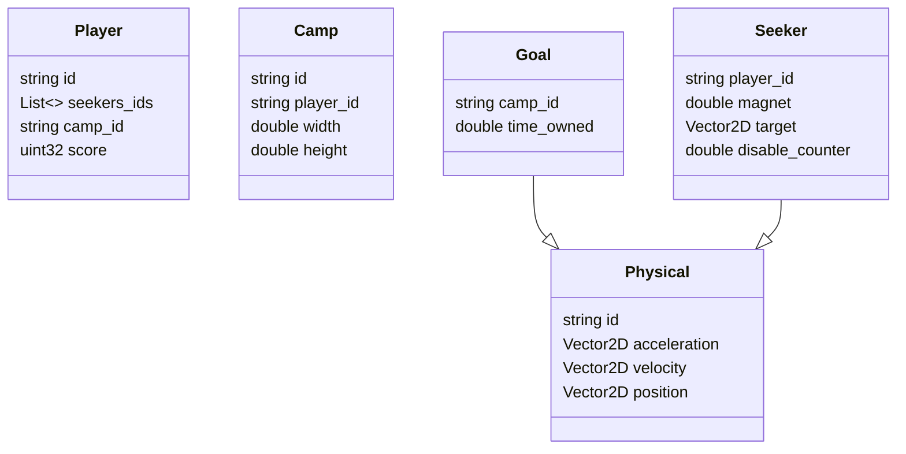
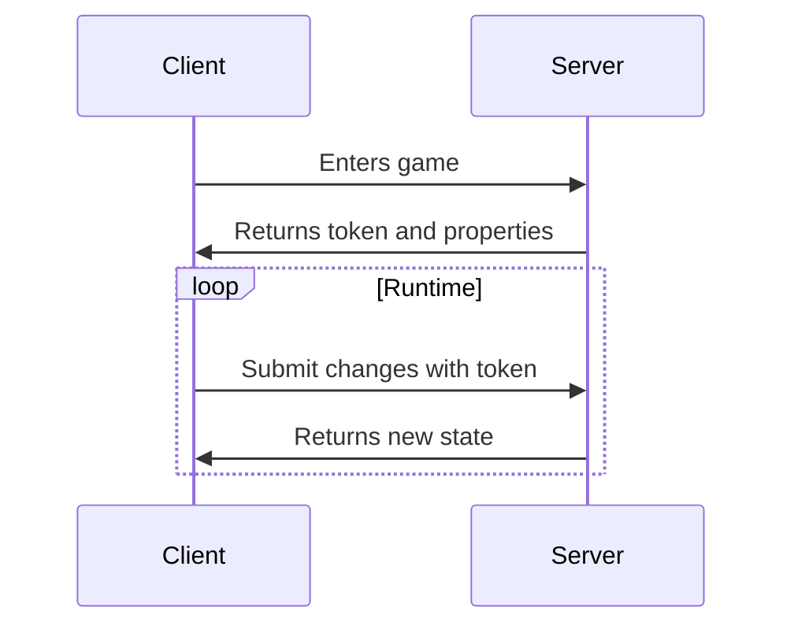

# API

Seekers uses the gRPC api for connecting a server with its clients.

## Messages

```mermaid
classDiagram
    class Player {
        string id
        List<<string>> seekers_ids
        string camp_id
        uint32 score
    }
    class Camp {
        string id
        string player_id
        double width
        double height
    }
    class Physical {
        string id
        Vector2D acceleration
        Vector2D velocity
        Vector2D position
    }
    class Goal {
        string camp_id
        double time_owned
    }
    class Seeker {
        string player_id
        double magnet
        Vector2D target
        double disable_counter
    }
    
    Goal --|> Physical
    Seeker --|> Physical
```

## Services

```mermaid
sequenceDiagram
    Client->> Server: Enters game
    Server->> Client: Returns token and properties
    loop Runtime
        Client->> Server: Submit changes with token
        Server->> Client: Returns new state
    end
```