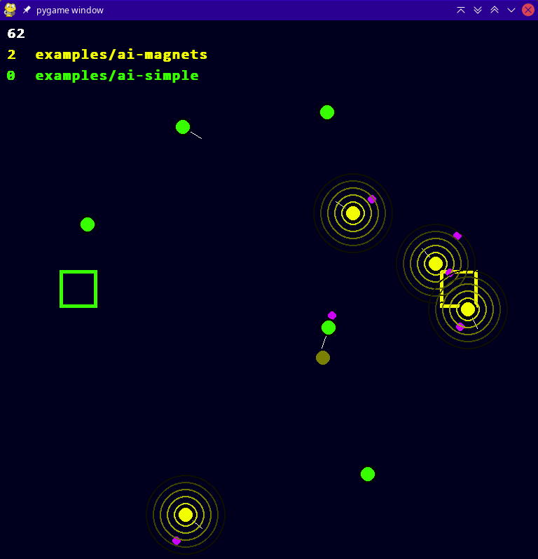

# The Game

Players compete by controlling little circles called "seekers". Every player has an underlying program, its AI. The player with the most points after `global.playtime` wins.

Players receive points by bringing balls, so called "goals", to their camp.

In this image you see two AIs competing. Each AI gets assigned a color. 
* The colored squares are the camps of their respective AI.
* The colored big circles are the seekers of their respective AI.
* The little purple circles are the goals.

## Player Input

Every time the player's AI is called, it can change the
1. **target**
2. **magnet strength**

of each of its seekers. 

To make this decision, it is aware of the whole game. This includes and is limited to:
* your own seekers
* the seekers of your opponents
* all goals
* all camps
* the passed playtime

### Seeker Information

* position, acceleration, velocity
* player (owner)
* magnet strength
* target
* time until they get enabled again

### Goal Information

* position, acceleration, velocity
* owner of the camp they were in last
* time that they spent in that camp

### Camp Information

* position and dimensions
* owner 
